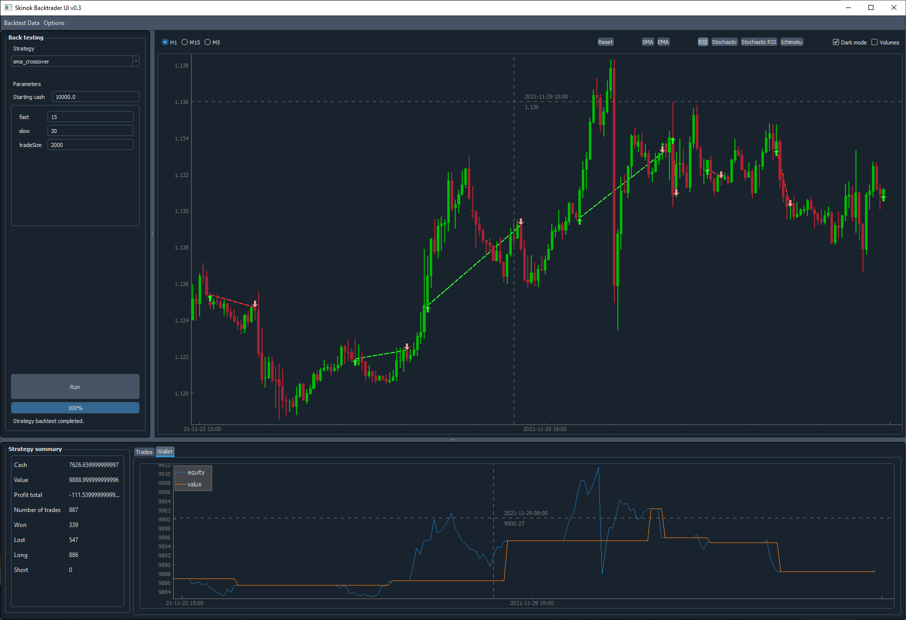

[](https://discord.gg/1108412998520938557)

# Skinok backtrader UI (PyQt and finplot)




# How to install ?

You should have python installed on your machine (obvisously)

Please run the following commands : 

```
pip install git+https://github.com/backtrader2/backtrader matplotlib requests \
            websocket websocket-client oandapy qdarkstyle git+https://github.com/blampe/IbPy.git \
            git+https://github.com/oanda/oandapy.git git+https://github.com/Skinok/finplot.git  
```

# How to use it ?

* Put your CSV Data in the *data* folder  
* Create your strategy and put it in the *strategies* folder  
 Your strategy *file* name should be exactly the same as the strategy *class* name  
 You can take a look at the provided exemples


